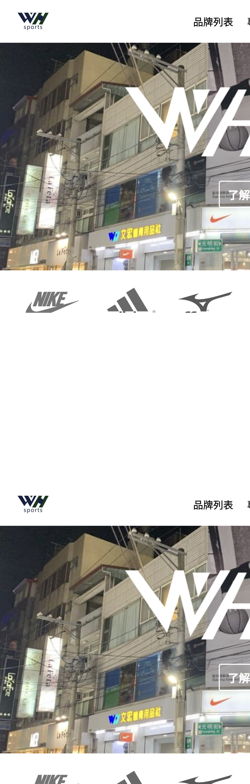
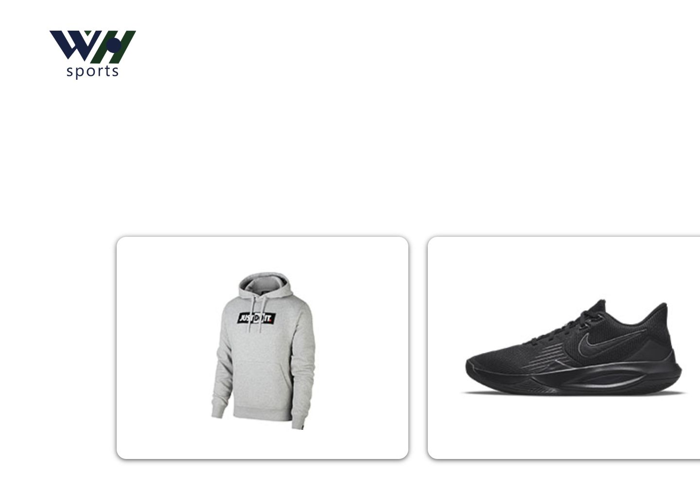
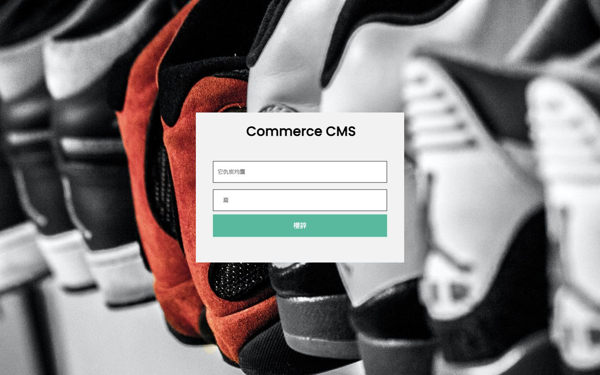

# 文宏運動用品電商網站

文宏運動用品電商網站是一個以 PHP 與 MySQL 建置的運動用品電商專案，包含前台商品瀏覽、會員登入註冊、購物車、結帳流程，以及後台商品、分類、會員與訂單管理功能。專案已部署於 InfinityFree，可作為 PHP/MySQL 全端作品展示。

## Demo

- 前台網站：https://winhorn-shopping.fwh.is/
- 後台入口：https://winhorn-shopping.fwh.is/admin

## 測試帳號

會員帳號：

```text
demo@example.com
demo123
```

後台帳號：

```text
admin
admin123
```

## 專案特色

- 運動用品電商首頁與品牌分類頁
- 商品列表、商品詳細頁與相關商品展示
- 會員註冊、登入、登出流程
- 購物車與結帳頁面
- 後台商品、品牌分類、子分類、會員與訂單管理
- MySQL 資料庫儲存商品、會員、購物車與訂單資料
- RWD 導覽列與品牌選單調整，支援手機與桌面瀏覽

## 專案截圖

首頁：



商品列表：



後台登入：



## 使用技術

- PHP
- MySQL
- HTML
- CSS
- JavaScript
- phpMyAdmin
- InfinityFree

## 資料庫

部署時請先建立 MySQL 資料庫，再匯入 SQL 檔。

InfinityFree 匯入請使用：

```text
graduateDB_infinityfree_import.sql
```

本機開發可使用：

```text
graduateDB_seed.sql
```

## 作品集說明

這個作品展示了傳統 PHP 網站從前台到後台的完整流程，包含資料庫連線、商品資料讀取、購物車操作、會員流程與後台 CRUD 管理。適合作為入門全端網頁開發、PHP/MySQL 電商系統與網站部署能力的作品。

## 專案結構

```text
graduateProject/
├── index.php
├── connection.inc.php
├── categories.php
├── products-detail.php
├── cart-page.php
├── checkout.php
├── admin/
├── css/
├── js/
└── images/
```
